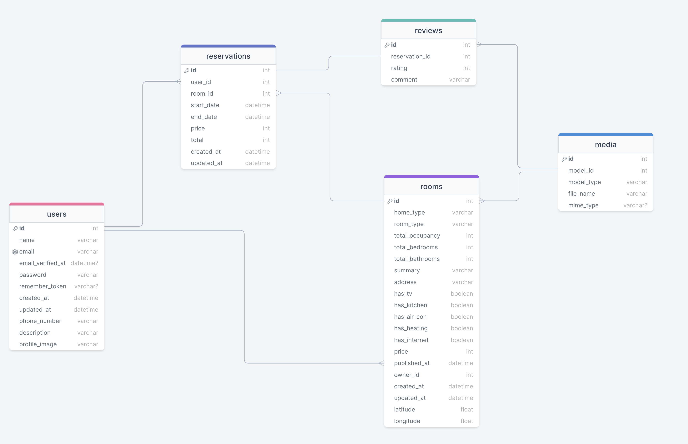

## Temas puntuales de la sección
Esta es una sección en la cual quiero que hablemos un poco sobre buenas practicas y estándares en cuanto a nombres de tablas, vistas y demás elementos de la base de datos.


También realizaremos un par de ejercicios adicionales para practicar y reforzar el diseño de bases de datos.


Al final, también leeremos un diagrama entidad-relación para que podamos comprender rápidamente cómo realizar algo similar a la estructura que nos funcionaría para crear algo como Airbnb, con este ejercicio espero que vean el beneficio directo de tener un diagrama de este tipo y el valor que tiene para nuevos miembros y nosotros mismos.

## Preguntemos 
- ¿Cuál es el objetivo de la misma?
- ¿Cómo usaremos la base de datos?

## En general un buen diseño
- Minimizar la redundancia
- Proteger la presición
- Ser accesible
- Cumplir las expectativas

## Determinar los objetivos
- Investigar previamente sobre diseños similares
- Traiga las partes interesadas
- Empápate del tema objetivo

## Principios a seguir
- Mantenla simple (solo nesesario para funcionar)
- Usa estandarización (mantener consistencia en los nombres de tablas, columnas, etc.)
- Considera futuras modificaciones 
- Mantén la deuda técnica a raya (resolver los problemas tecnicos que se puedan presentar en el futuro lo mas posible mente)
- Normalizar la data (No tener muchos valores nulos, evitar redundancia de datos)
- Diseña a largo plazo
- Crear documentación y diagramas
- Prueba tu diseño.

- No uses abreviaturas *. Internationalization por i18n
- Se recomienda nombres tablas en singular.
- No re-inventar la rueda.
- Usa lo que el motor de base de datos te ofrece.
- Reglas, checks, llaves, indices, para evitar basura.
- Mantén la privacidad como prioridad. (Encriptar datos sensibles)
- Nombres en inglés y evitar caracteres especiales
- Todo en minúsculas sin espacios.


NOTA: La base de datos es lo mas importante de la empresa, por lo que es necesario diseñarla de manera eficiente y segura.

## Diseños de BD y buenas prácticas Parte 2
- Mantén la base de datos en su propio servidor.
- Mantén un modelado bajo versiones.
- Establece el tipo apropiado y precisión adecuada.
- No confíes en identificades de terceros.
- Define las llaves foráneas y relaciones.
- Si el esquema es muy grande, particionalo.
- Evita nombres reservados "user", "table", "create".

## Ideas a tener en mente
- Los nombre de tablas y campos vivirán más que las aplicaiones.
- Los nombres son contratos.
- La base de datos gobierna sobre lo demas.

Enfocar buen tiempo para realizar un buen diseño de base de datos, porque persistirá durante mucho tiempo.

## Relaciones en singular
Tablas, vistas y cualquier relación en singular.

- Es posible tener una relación uno a uno, ¿seguiría esto siendo plural?
- En ingles hay palabras que no tienen forma plural, (fish, species, series).
- Mucho software trabaja siguiendo esta regla de singular, y se usar mejor de esa forma. (Sentido semántico).

## Nombrado explícito
Evitar redundancia y lectura adicional
- person_id vs id
- Las llaves foráneas deben ser una combinación. Por ejemplo 
```sql
CREATE TABLE team_member (
    team_id bigint NOT NULL REFERENCES team(id),
    person_id bigint NOT NULL REFERENCES person(id),
    CONSTRAINT team_member_pkey PRIMARY KEY (team_id, person_id)
);
```
- Indices deben ser explícitos:
person_index_first_name_last_name

## Nombrado explicito 
Así cuando algo falla, sabemos qué falló
PostgreSQL genera buenos nombres automáticamente

## Ideas finales
- Si ya hay una extructura creada que sigue otras reglas, sigamos esas reglas.*
- No mezclemos ideoleogias si no pensamos cambiar todo.
- Estos pasos son útiles para empezar nuevos diseños.

## Diseño - WarehouseDB

```
enum product_status{
  in_stock
  out_of_stock
  running_low
}

enum order_status{
  placed
  confirm
  processed
  complete
}

table product{
  id int [pk, increment]
  serial varchar
  name varchar(200)
  merchant int [ref: > merchant.id]
  price float(8, 2)
  status product_status
  stock int

  created_at timestamp [default: 'now()']
}

table merchant {
  id int [pk, increment]
  name varchar
  country int [ref: > country.id]

  created_at timestamp [default: 'now()']
}

table country{
  id int [pk, increment]
  name varchar

}

table order {
  id int [pk, increment]
  status order_status
  user_id int
  total float(12, 2)
  created_at timestamp [default: 'now()']
}

table order_item{
  id int [pk, increment]
  order_id int [ref: > order.id]
  product_id int [ref: > product.id]
  quantity int
}


```

```SQL
CREATE TYPE "product_status" AS ENUM (
  'in_stock',
  'out_of_stock',
  'running_low'
);

CREATE TYPE "order_status" AS ENUM (
  'placed',
  'confirm',
  'processed',
  'complete'
);

CREATE TABLE "product" (
  "id" INT GENERATED BY DEFAULT AS IDENTITY PRIMARY KEY,
  "serial" varchar,
  "name" varchar(200),
  "merchant" int,
  "price" float(8,2),
  "status" product_status,
  "stock" int,
  "created_at" timestamp DEFAULT 'now()'
);

CREATE TABLE "merchant" (
  "id" INT GENERATED BY DEFAULT AS IDENTITY PRIMARY KEY,
  "name" varchar,
  "country" int,
  "created_at" timestamp DEFAULT 'now()'
);

CREATE TABLE "country" (
  "id" INT GENERATED BY DEFAULT AS IDENTITY PRIMARY KEY,
  "name" varchar
);

CREATE TABLE "order" (
  "id" INT GENERATED BY DEFAULT AS IDENTITY PRIMARY KEY,
  "status" order_status,
  "user_id" int,
  "total" float(12,2),
  "created_at" timestamp DEFAULT 'now()'
);

CREATE TABLE "order_item" (
  "id" INT GENERATED BY DEFAULT AS IDENTITY PRIMARY KEY,
  "order_id" int,
  "product_id" int,
  "quantity" int
);

ALTER TABLE "product" ADD FOREIGN KEY ("merchant") REFERENCES "merchant" ("id");
ALTER TABLE "merchant" ADD FOREIGN KEY ("country") REFERENCES "country" ("id");
ALTER TABLE "order_item" ADD FOREIGN KEY ("order_id") REFERENCES "order" ("id");
ALTER TABLE "order_item" ADD FOREIGN KEY ("product_id") REFERENCES "product" ("id");
```

## Twiter 
```

Table user {
  id int [pk, increment]
  name varchar(100)
  slug varhar(50)
  email varchar [unique]
  bio text

  create_at timestamp [default: 'now()']
}

table tweet{
  id int [pk, increment]
  content varchar(150)
  user_id int [ref: > user.id]

  created_at timestamp [default: 'now()']
}

table follower{
  id int [pk, increment]
  follower_id int [ref: > "user"."id"]
  followed_id int [ref: > "user"."id"]
  created_at timestamp [default: 'now()']
}

```

```SQL
CREATE TABLE "user" (
  "id" INT GENERATED BY DEFAULT AS IDENTITY PRIMARY KEY,
  "name" varchar(100),
  "slug" varhar(50),
  "email" varchar UNIQUE,
  "bio" text,
  "create_at" timestamp DEFAULT 'now()'
);

CREATE TABLE "tweet" (
  "id" INT GENERATED BY DEFAULT AS IDENTITY PRIMARY KEY,
  "content" varchar(150),
  "user_id" int,
  "created_at" timestamp DEFAULT 'now()'
);

CREATE TABLE "follower" (
  "id" INT GENERATED BY DEFAULT AS IDENTITY PRIMARY KEY,
  "follower_id" int,
  "followed_id" int,
  "created_at" timestamp DEFAULT 'now()'
);

ALTER TABLE "tweet" ADD FOREIGN KEY ("user_id") REFERENCES "user" ("id");

ALTER TABLE "follower" ADD FOREIGN KEY ("follower_id") REFERENCES "user" ("id");

ALTER TABLE "follower" ADD FOREIGN KEY ("followed_id") REFERENCES "user" ("id");

```

## Idea AIRBNB
