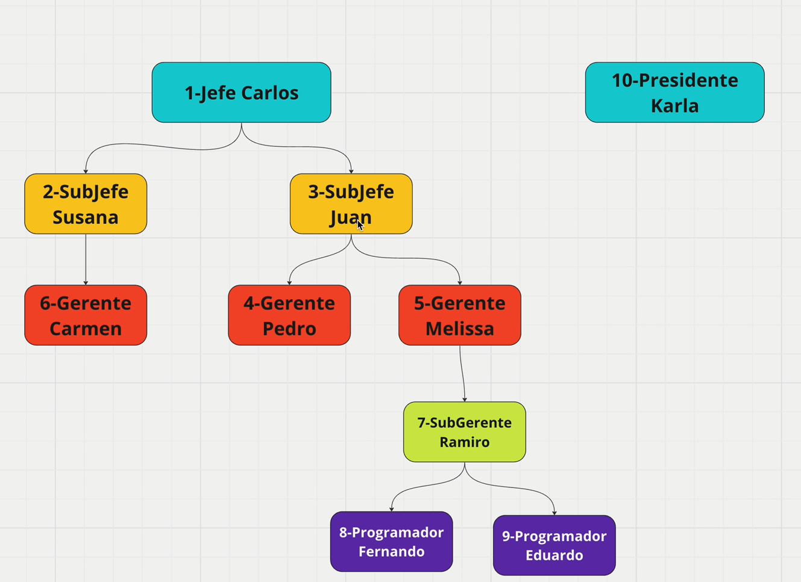
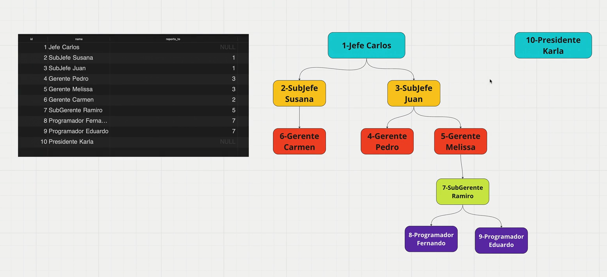

## Vistas
Una vista es una tabla virtual que se basa en una consulta SQL.
## Vistas materializadas
Una vista materializada es una tabla física que se actualiza periódicamente con los resultados de la consulta SQL. La data no se actualiza automáticamente, por lo que es necesario actualizarla manualmente. Una vez creada, la vista materializada puede ser consultada como si fuera una tabla regular.

## Common table expressions (CTE)
Una common table expression (CTE) es una consulta SQL que se define temporalmente y se puede referenciar en la misma consulta. Las CTEs pueden ser utilizadas para mejorar la legibilidad y la mantenibilidad de las consultas complejas. El query principal puede referenciar a la CTE como si fuera una tabla regular.

## Common table expressions recursive
Una common table expression recursive (CTE recursive) es una consulta SQL que se define temporalmente y se puede referenciar en la misma consulta. Las CTEs recursivas pueden ser utilizadas para mejorar la legibilidad y la mantenibilidad de las consultas complejas. El query principal puede referenciar a la CTE recursiva como si fuera una tabla regular. Se usa cuando se tiene una estructura jerárquica en los datos, como por ejemplo, una tabla de empleados que tiene una relación de padre-hijo.

## Temas puntuales de la sección
Esta sección tiene por objetivo aprender sobre dos temas principales que a su vez, tienen variaciones:

- Vistas
- Vistas Materializadas
- CTE - Common Table Expressions
- CTE - Recursivos

Es una sección que puede sentirse algo complicada, pero los ejemplo que realizaremos tienen por objetivo aprender a trabajar con ellos de una forma simple.

Lo que esperaría, es que sepan encontrar cuándo un problema se puede resolver con un query recursivo y cuando se puede hacer sin recursividad para la facilidad de lectura.

## Preparación
Antes de comenzar, es necesario tener instalado PostgresSQL y Docker Compose.

restaurar desde la base de datos medium-db.sql y  comments-table.sql

## Vistas
Agrupar los post por semana y mostrar la cantidad de posts publicados en cada semana. La vista solo almacena el query no es una tabla física.
```SQL
CREATE VIEW comments_per_week as
SELECT date_trunk('week', posts.created_at) as weeks,
	COUNT(DISTINCT posts.post_id) AS number_of_posts,
	SUM(claps.counter) AS total_claps
FROM POSTS
INNER JOIN claps ON claps.post_id = posts.post_id
GROUP BY weeks
ORDER BY weeks DESC;
```
Seleccionar el numero de posts y clamps por semana
```SQL
SELECT * FROM comments_per_week;
```

Elimnar la vista comments_per_week
```SQL
DROP VIEW comments_per_week;
```

## Vistas materializadas
Una vista materializada es una tabla física que se actualiza periódicamente con los resultados de la consulta SQL. La data no se actualiza automáticamente, por lo que es necesario actualizarla manualmente. Una vez creada, la vista materializada puede ser consultada como si fuera una tabla regular.
Ejemplo de uso un aeropuerto, se puede crear una vista materializada que muestre los vuelos que salen de un aeropuerto en una determinada fecha. Pero si quiero esta informacion rapidamente, puedo consultar la vista materializada. Esta vista materializada se actualiza cuando no tenemos un trafico en el sistema del araeropuerto.

```SQL
CREATE MATERIALIZED VIEW comments_per_week_mat AS
 SELECT date_trunc('week'::text, posts.created_at) AS weeks,
    count(DISTINCT posts.post_id) AS number_of_posts,
    sum(claps.counter) AS total_claps
   FROM (posts
     JOIN claps ON ((claps.post_id = posts.post_id)))
  GROUP BY (date_trunc('week'::text, posts.created_at))
  ORDER BY (date_trunc('week'::text, posts.created_at)) DESC;
```
```SQL
  SELECT * FROM comments_per_week;
```
Para actualizar la vista materializada comments_per_week_mat
```SQL
REFRESH MATERIALIZED VIEW comments_per_week_mat;
```
## Cambiar el nombre de la vista materializada y vista normal


```SQL
ALTER VIEW comments_per_week RENAME TO posts_per_week;
```
```SQL
ALTER MATERIALIZED VIEW comments_per_week_mat RENAME TO posts_per_week_mat;
```

## Common table expressions (CTE)
Los Common Table Expressions (CTE) son una forma de definir una subconsulta temporal dentro de una consulta principal. Las CTEs se utilizan para mejorar la legibilidad y la mantenibilidad de las consultas complejas. Solo se usan en dos casos, para simplificar queries, queries demaciado grandes, separar en queries mas sencillos.

```SQL
WITH post_week_2024 AS(
SELECT date_trunc('week'::text, posts.created_at) AS weeks,
    sum(claps.counter) AS total_claps,
    count(DISTINCT posts.post_id) AS number_of_posts,
    count(*) AS number_of_claps
   FROM posts
     JOIN claps ON claps.post_id = posts.post_id
  GROUP BY (date_trunc('week'::text, posts.created_at))
  ORDER BY (date_trunc('week'::text, posts.created_at)) DESC
)
SELECT * FROM post_week_2024
WHERE weeks BETWEEN '2024-01-01' AND '2024-12-31' AND total_claps >= 300;
```
Donde si son totalmente el uso de los common table expressions, es en los queries recursivos.

### Multiples CTEs

Los posts totales en 2023 :
```SQL	
WITH claps_per_posts AS (
	SELECT post_id, sum(counter) FROM claps
	GROUP BY post_id
),
posts_from_2023 as (
	SELECT * FROM posts WHERE created_at BETWEEN '2023-01-01' AND '2023-12-31'
)
SELECT * FROM claps_per_posts
WHERE claps_per_posts.post_id IN (
	SELECT post_id FROM posts_from_2023 
);
```

## CTE - Recursivos
Los queries recursivos son queries que se ejecutan varias veces, hasta que se cumple una condición. En cada iteración, se actualizan los datos y se vuelve a ejecutar el query. Muy usados en estructuras de datos como árboles, de tipo jerárquico.



```SQL
-- NOMBRE DE LA TABLA EN MEMORIA
-- CAMPOS QUE VAMOS A TENER

WITH RECURSIVE countdown (val) AS (
  -- Initializatio => el primer nivel, o valores iniciales
  SELECT 5 AS val
  UNION
  -- QUERY RECURSIVO
  SELECT val - 1 FROM countdown
  WHERE val > 0
)
-- SELECT DE LOS CAMPOS
SELECT * FROM countdown;
```

```SQL

WITH RECURSIVE countup (val) AS (
  -- Initializatio => el primer nivel, o valores iniciales
  SELECT 1 AS val
  UNION
  -- QUERY RECURSIVO
  SELECT val + 1 FROM countup
  WHERE val < 10
)
-- SELECT DE LOS CAMPOS
SELECT * FROM countup;
```

## Tabla de multiplicar 1 a 10
```SQL
WITH RECURSIVE multiplication_table (base, val, result) AS (
  -- Initializatio => el primer nivel, o valores iniciales
  SELECT 5 AS base, 1 AS val, 5*1 AS result
  UNION
  -- QUERY RECURSIVO
  SELECT base, val + 1, base * (val + 1) FROM multiplication_table
  WHERE val < 10
)
-- SELECT DE LOS CAMPOS
SELECT * FROM multiplication_table;
```

## Preparación tabla empleados



```SQL
CREATE TABLE employees (
    id SERIAL PRIMARY KEY,
    name VARCHAR(100),
    report_to INT REFERENCES employees(id)
);
```
```SQL
INSERT INTO employees (id, name, report_to)
VALUES
    (1, 'Jefe Carlos', NULL),
    (2, 'SubJefe Susana', 1),
    (3, 'SubJefe Juan', 1),
    (4, 'Gerente Pedro', 3),
    (5, 'Gerente Melissa', 3),
    (6, 'Gerente Carmen', 2),
    (7, 'SubGerente Ramiro', 5),
    (8, 'Programador Fernando', 7),
    (9, 'Programador Eduardo', 7),
    (10, 'Presidente Karla', NULL);
```

Todos los del primer nivel de Jefe Carlos
```SQL
SELECT * FROM employees WHERE report_to = 1;
```

## CTE recursivo - estructura organizacional
```SQL
WITH RECURSIVE bosses as (
  -- Init
  SELECT id, name, report_to FROM employees WHERE id = 1
  UNION
  -- Recursive
  SELECT employees.id, employees.name, employees.report_to FROM employees
  INNER JOIN bosses ON bosses.id = employees.report_to
)
SELECT * FROM bosses;
```

# Insertar un nuevo empleado
```SQL
INSERT INTO employees (id, name, report_to)
VALUES
    (11, 'Jr Mariano', 8);
```

# CTE - Recursivo - Estructura organizacional con limite de nivel 2
```SQL
WITH RECURSIVE bosses as (
  -- Init
  SELECT id, name, report_to, 1 as depth FROM employees WHERE id = 1
  UNION
  -- Recursive
  SELECT employees.id, employees.name, employees.report_to, bosses.depth + 1 FROM employees
  INNER JOIN bosses ON bosses.id = employees.report_to
  WHERE bosses.depth < 2
)
SELECT * FROM bosses;
```

-- Mostrar los nombres de la persona a la que el empleado reporta
```SQL
WITH RECURSIVE bosses as (
  -- Init
  SELECT id, name, report_to, NULL::character varying as boss_name, 1 as depth FROM employees WHERE id = 1
  UNION
  -- Recursive
  SELECT employees.id, employees.name, employees.report_to, bosses.name as boss_name, bosses.depth + 1 FROM employees
  INNER JOIN bosses ON bosses.id = employees.report_to
  WHERE bosses.depth < 2
)
SELECT id, name, report_to, boss_name, depth FROM bosses;
```


```SQL
WITH RECURSIVE bosses as (
  -- Init
  SELECT id, name, report_to, 1 as depth FROM employees WHERE id = 1
  UNION
  -- Recursive
  SELECT employees.id, employees.name, employees.report_to, bosses.depth + 1 FROM employees
  INNER JOIN bosses ON bosses.id = employees.report_to
  WHERE bosses.depth < 2
)
SELECT bosses.*, employees.name as reports_to_name FROM bosses
LEFT JOIN employees ON employees.id = bosses.report_to
ORDER BY depth;
```
