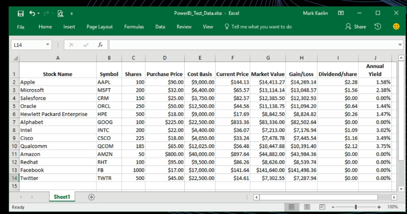
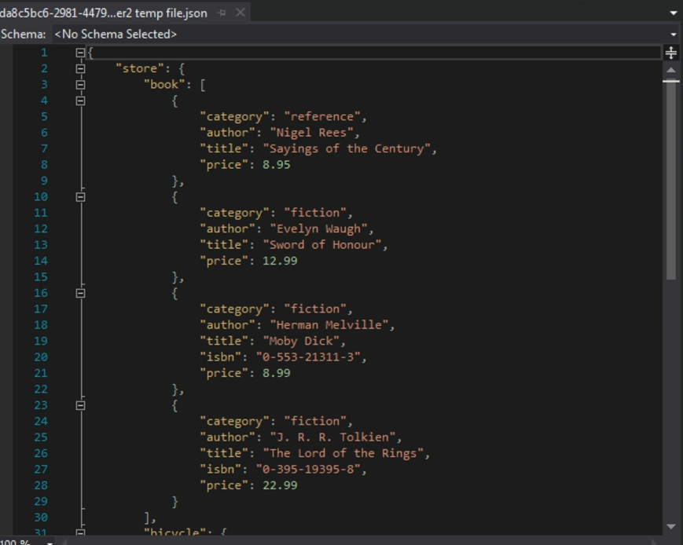

## Temas puntuales de la sección
El objetivo de esta sección es empezar nuestro camino en las bases de datos con las sentencias más comunes y explicaciones generales para comprender a qué nos estamos metiendo.

Puntualmente veremos:

Queries
Creación de tablas
Drop / Truncate

SELECT
INSERT
DELETE
UPDATE

Funciones y operadores como:
Substring
Position
Concat
||
Constrains básicos
Serial
La idea principal es tener nuestra introducción en un ambiente controlado que nos permita jugar y aprender desde cero y poco a poco, ir escribiendo sentencias más específicas.

## Introduccion de Base de datos

### Que es una base de datos?
Una base de datos es una coleccion estructurada de informacion organizada y almacenada de manera sistematica en un sistema de gestion de base de datos (SGBD).

La forma de almacenar la informacion hace la diferecia, tenemos dos principales tipos de base de datos:

### SQL:
Son base de datos relacionales, almacena la informacion en tablas, estas tablas  tienen relaciones claras, estructuradas, estrictas y bien definidas unas con otras. Pueden lucir mucho como sheets de excel.



### NoSQL:
Almacen la informacion en objetos que usalmente se llaman documentos. Este tipo de informacion luce similar a objetos JSON.




## SQL

| SQL | Esquema predifinido| Consistencia | Almacenamiento | Indices |
|-----------|--------------|--------------|----------------|---------|
| significa | Antes de usarla | Enfoque | Forma | Velocidad |
| Structured Query Language | Se craean tablas con la estructura que usaremos de antemano | Se enfocan en garantizar integridad y consistencia de informacion  |    Se graban en forma de tablas y los regiatros en filas | Llaves primarias, foraneas, indices compuestos, etc |
| Todas estas base de datos ejecutan sentencias "queries" de forma similar | | | Tambien conocidos como entidades y atributos | Permite velocidades de transacciones |

### NoSQL

| Almacenamiento | Esquema flexible | Enfoque | Tolerancia | 
|----------------|------------------|---------|------------|
|   Docuementos  |  No es rigido    |  Rendimiento | A fallos |
| Usualmente conocidos como colecciones y documentos. La infromacion se almacena en estos objetos JSON | Puedes crear documentos y colecciones sin tener que definirlas | Escalabilidad horizontal, rendimiento, velocidad y disponibilidad | Gran flexibilidad permite una gran tolerancia a fallos y valores nulos o inexistentes. |

### Escalabilidad Horizontal
En lugar de comprar una computadora mas poderosa para almacenar mi base de datos, se crean otro nodo, la informacion esta no en un solo nodo, sino que se encuetra distribuida en diferentes nodos.

### Cual es mejor?
No hay una respuesta en concreto, Depende del uso, flexibilidad, vision, mision, no hay una restriccion en especifico que te impida irte por una SQL o NoSQL.

### SQL
Aprender a trabajar con base de datos relacionales, normalizacion, escribir queries y ensi, todo lo que se necesita para empezar a trabajar en cualquier base de datos relacional.

### Creacion de tablas

Un comando corto para abrir en table plus el command line sql:
```bash
ctrl + t new window
ctrl + w close window
```

Crear una tabla en sql:
```sql
create table users(
    name VARCHAR(100) UNIQUE
);
```

Un constrain es una regla que se aplica a una columna para garantizar la integridad y consistencia de la informacion. Es UNIQUE, lo que significa que no puede haber dos registros con el mismo valor en esa columna.

Para realizar un commit en el script de sql en table plus:
```bash
ctrl + enter
```

Para realizar un commit en  la edicion de tablas de table plus:
```bash
ctrl + s
```

Para hacer un refresh en table plus:
```bash
ctrl + r
```
Command i en table plus es para mejorar el query a realizar su estructura:
```bash
ctrl + i
```
Para hacer un rollback en table plus:
```bash
ctrl + z
```

Para comentar en table plus:
```bash
ctrl + /
```

### Insertar datos en una tabla

Insertar un registro en una tabla:
```sql
insert into users (name) values ('jose');
```

Insertar multiples registros en una tabla:
```sql
insert into users (name) values ('monserrat'), ('ana'), ('maria');
```

Insertar en  todas las columnas de una tabla:
```sql
insert into users  values ('Vanessa');
```

### Actualizar los registros
Actualizar un registro en una tabla:
```sql
update users set name = 'juan' where name = 'jesus';
```
Cuando se esta trabajando en una empresa se recomienda desactivar el autocomit para evitar que se hagan cambios en la base de datos sin querer.

Para desactivar el autocomit en postgrest:

```bash
auto commit;
```
### Seleccionar datos de una tabla

Seleccionar todos los registros de una tabla:
```sql
select * from users;
```

Seleccionar todos los registros de una tabla los primeros 3: 
```sql
select * from users limit 3;
```
Seleccionar 3 registros pero empezando por el 2:
```sql
select * from users limit 3 offset 2;
```

Contar una cantidad de registros de una tabla:
```sql
select count(*) from users;
```

Clausula where:
Seleccionar todos los registros de una tabla donde el nombre sea Juan:
```sql
select * from users where name = 'Juan';
```

Uso del like para buscar por patron:

Seleccionar todos los nombres que terminen con J:
```sql
select * from users where name like 'j%';
```

Seleccionar todos los nombres que terminen con a:
```sql
select * from users where name like '%a';
```
 
Seleccionar todos los registros que tienen una a en el nombre:
```sql
select * from users where name like '%a%';
```

Seleccionar todos los nombres que empiecen con m y seguido de cualquier caracter:
```sql
select * from users where name like 'm_%';
```

### Eliminar registros de una tabla
Se recomienda usar un select antes de eliminar para verificar que se este eliminando el registro correcto.

Eliminar un registro de una tabla:
```sql
delete from users where name = 'jose';
```

Eliminar todos los registros de una tabla:
```sql
delete from users;
```

### Eliminar una tabla
Eliminar una tabla:
```sql
drop table users;
```
Pueden existir ciertos constraints en una tabla, como primary key, foreign key, etc, que pueden impedir la eliminacion de la tabla.

El truncate es una forma de eliminar todos los registros de una tabla de manera mas rapida que el delete.
```sql
truncate table users;
```

### Tareas uno

-- 1. Ver todos los registros
```sql
select * from users;
```

-- 2. Ver el registro cuyo id sea igual a 10
```sql
select * from users where id = 10;
```

-- 3. Quiero todos los registros que cuyo primer nombre sea Jim (engañosa)
```sql
select * from users where name like 'Jim %';
```

-- 4. Todos los registros cuyo segundo nombre es Alexander
```sql
select * from users where name like '% Alexander';
```

-- 5. Cambiar el nombre del registro con id = 1, por tu nombre Ej:'Fernando Herrera'
```sql
update users set name = 'Jose Balbuena' where id = 1;
```

```sql
select * from users where id = 1;
```
-- 6. Borrar el último registro de la tabla


```sql
select name from users where id in (select id from users order by name desc limit 1);
select max(id) from users;

delete  from users where id in (select id from users order by name desc limit 1);
delete from users where id = (select max(id) from users);
```

### Operadores de strings


```sql
select 
    id, 
    upper(name) as upper_name,
    lower(name) as lower_name,
    LENGTH(name) as tamanio,
    name,
    3.1416 as pi, 
    '*'||id||'-'||name||'*' as barcode,
    concat(id, '-',name)
from
    users;
```

### Substring y position

Creando un substring del nombre de 0 a 5
```sql
select 
	name,
	SUBSTRING(name, 0, 5)
FROM users;
```

Position nos permite encontrar la posicion de un caracter en una cadena de texto.
```sql
select 
	name,
	POSITION('a' in name)
FROM users;
```

Separar los dos nombres en last y first name
```sql
select 
	name,
	SUBSTRING(name, 0, POSITION(' ' in name)) as first_name,
	SUBSTRING(name, POSITION(' ' in name) + 1) as last_name,
    TRIM(SUBSTRING(name, POSITION(' ' in name))) as last_name_trim
FROM users;
```

### Crear una nueva columna 
Vamos a crear dos nuevas columnas first_name y last_name, como varchar(50).
```sql
alter table users add column first_name varchar(100);
alter table users add column last_name varchar(100);
```

Rellenar con los valores de la columna name
```sql
update users set first_name = SUBSTRING(name, 0, POSITION(' ' in name));
update users set last_name = SUBSTRING(name, POSITION(' ' in name) + 1);
```