## Temas puntuales de la sección
El objetivo de esta sección es comprender sobre las llaves que no son más que constraints (restricciones)


Puntualmente veremos:

Exposición sobre las relaciones de bases de datos

Exposición sobre las llaves y diferentes tipos de llaves

Checks de columnas y tablas

Indices

Llaves foráneas

Restricciones con las relaciones

Eliminaciones y actualizaciones en cascada

Otros tipos de acciones automáticas.

## Introducción a las relaciones

Cuando una base de datos lo mas seguro es que tengamos mas de una tabla,
en este caso, las relaciones entre las tablas son muy importantes.

### Tipos de relaciones:
- Uno a uno -> One to One (1:1)
- Uno a muchos -> One to Many (1:N)
- Relaciones a si mismas -> Self Joining Relationship
- Muchos a muchos -> Many to Many (N:M)

## Relaciones Uno a Uno
Tenemos una tabla por ejemplo students y tenemos un registro en contact_info del estudiante, solo puede aver un registro en contact_info por estudiante, es de uno a uno.
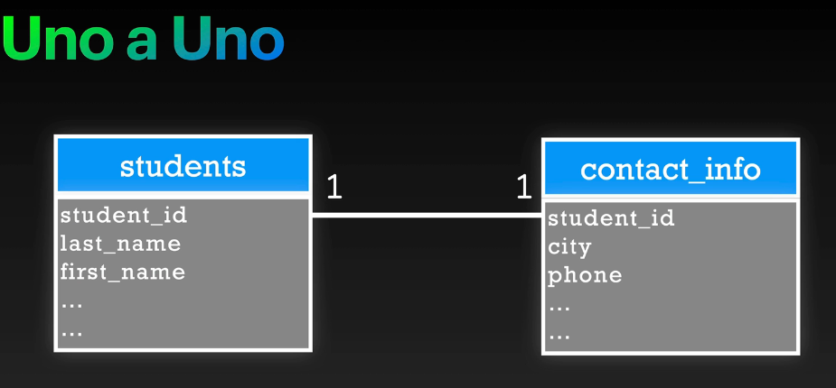

## Relaciones Uno a Muchos
Tenemos una tabla por ejemplo customers y tenemos un registro de varias orders del customer, puede haber muchas orders por customer, es de uno a muchos.
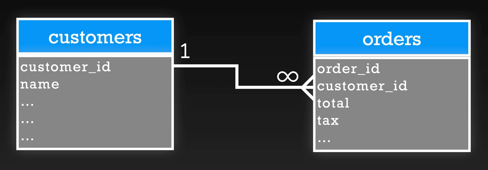

## Relacion Self Joining

Por ejemplo puedo tener una tabla de usuarios, y puedo tener la informacion de que usuario modifica a otro usuario, es de relacion self joining, un usuario puede modificar a otro usuario, y puede haber muchos usuarios que modifiquen a otro usuario.
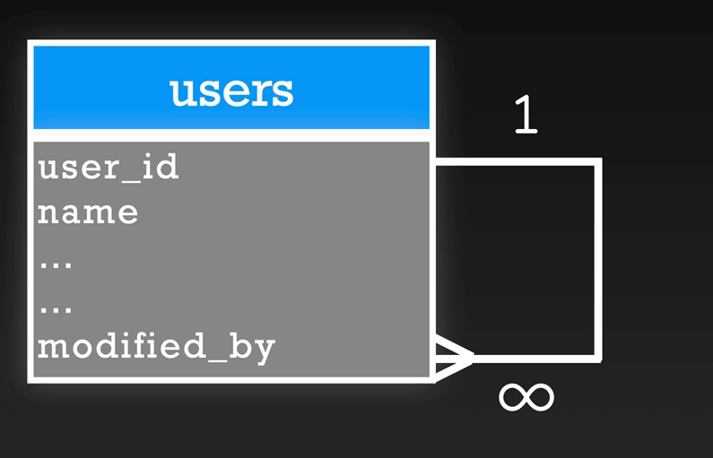

## Relaciones Muchos a Muchos
Ejemplo tenemos la tabla estudiantes, una tabla intermedia enrollments y una tabla cursos, un estudiante puede matricularse en muchos cursos, y un curso puede tener muchos estudiantes, es de relacion muchos a muchos.
Pero realmete la tabla intermedia enrollments tiene dos llaves foraneas, una a la tabla estudiantes y otra a la tabla cursos, y cada registro en la tabla intermedia enrollments es una matricula de un estudiante en un curso. Solo tenemos relaciones de uno a muchos en la tabla intermedia enrollments, y muchos a uno de la tabla enrollments a clases .
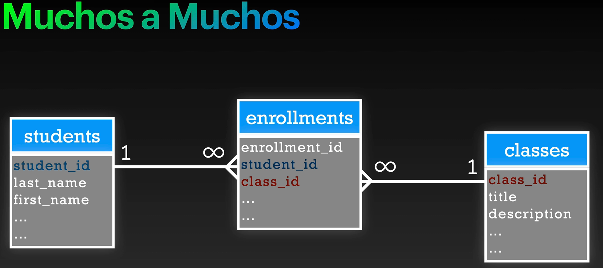

## En esta seccion estaremos trabajando

Con una estructrura de tres tablas la tabla country, la tabla city, la tabla countryLanguage, donde las relaciones son:
- country y city -> Uno a Muchos (1:N)
- country y countryLanguage -> Uno a Muchos (1:N)

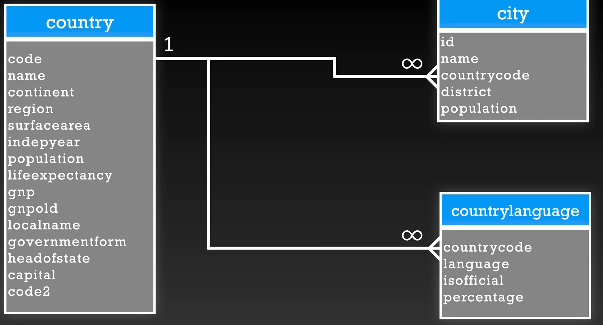

## Introducción a las llaves

Para que las relaciones de las base de datos se ocupan las llaves. Se puede trabajar sin llaves, pero eso no es recomendable, ya que las llaves ayudan a mantener la integridad referencial de la base de datos. La integridad referencial se refiere a la relacion entre las tablas, y las llaves ayudan a asegurar que los datos esten relacionados de manera correcta.
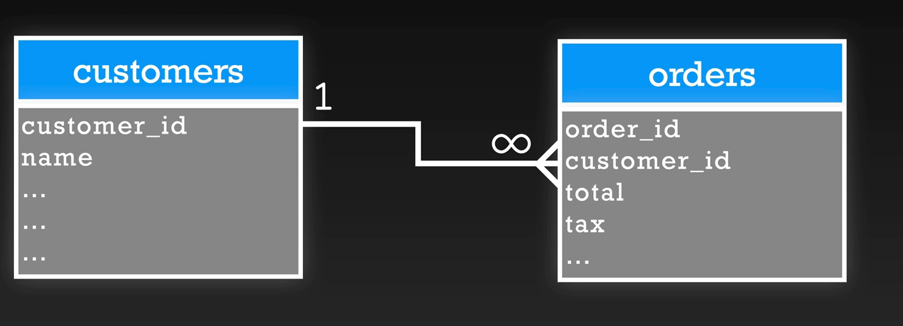

Tenemos diferentes tipos de llaves:
- Primary Key (PK)
- Foreign Key (FK)
- Super Key
- Candidate Key
- Composite Key

Hay mas y todas las llaves sirven para identificar registros.
Entre otras: Alternate keys, Artificial Keys.

Una llave no es mas que un constraint (restriccion) que ayuda a identificar registros unicos. Un constrain es solo una restriccion que se aplica a una columna o a varias columnas.

### Primary Key (PK)
-   Identifica un registro de forma unica.
-   Una table puede tener varios identificadores unicos.
-   La llave primaria esta basada en los requerimientos.

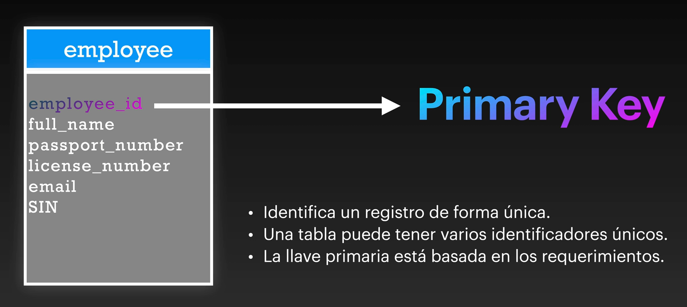

Los ID que se manejan en mi tabla, no debe depender de terceros, por que estas llaves prueden cambiar, es mejor tener un id idenpendiente controlado por nosotros.

### Candidate Key (CK)
-   Un atributo o cinjunto de ellos que identifica de forma unica
-   Menos la llave primaria, los demas se consideran claves candidatas.

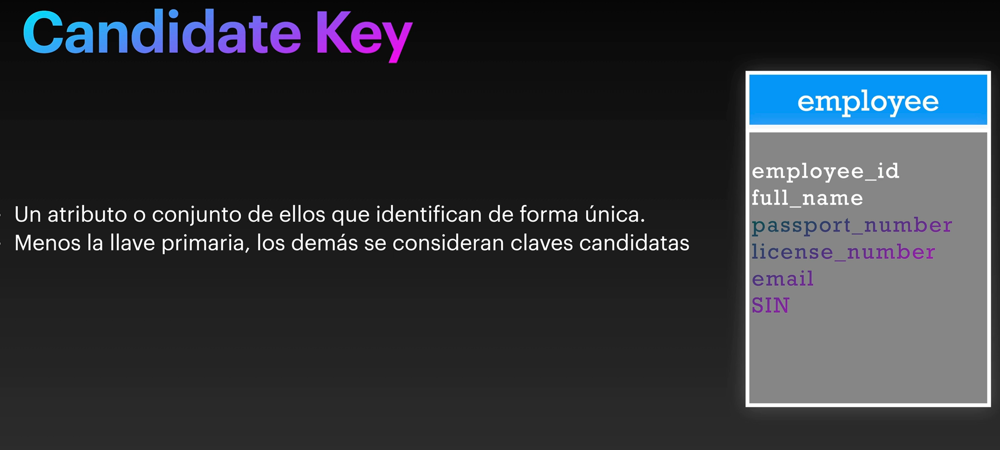

### SuperKey
-   Es un conjunto de atributos que pueden identificar de forma unica un registro.
-   Puede contener mas de una llave candidata, es un super conjunto de una clave candidata, ejemplo (employee_id + full_name).
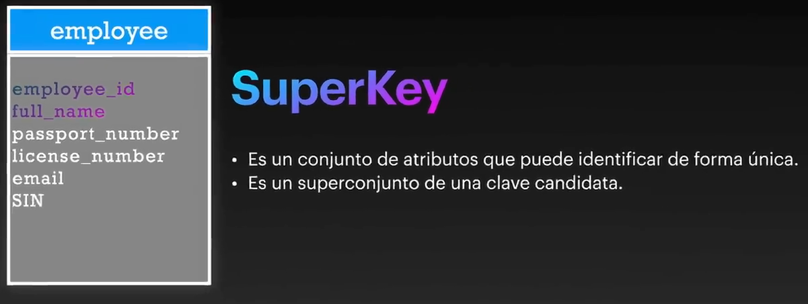

### Foreign Key (FK)
-   LLaves foraneas son usadas para apuntar a la llave primaria de otra tabla
-   El departament_id en ambas tablas, debe ser del mismo tipo de datos y longitud. Esto se hace para asegurar integridad referencial.
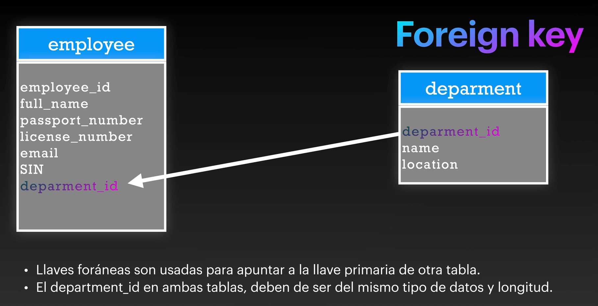

### Composite Key
-   Cuando una clave primaria consta de mas de un atributo, se conoce como clave compuesta.
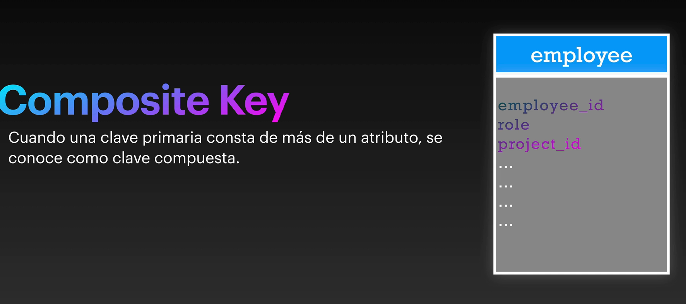

### Anadimos las tres base de datos para trabajar

## Crear llavez primarias 

Seccionamos tods los paises
```sql
SELECT * FROM country;
```
Las llaves primarias identifican de manera unica a un registro en una tabla.
```sql
ALTER TABLE country
    ADD PRIMARY KEY (code);
```
Tenemos un code duplicado:
```sql
Query 1: ERROR:  could not create unique index "country_pkey"
DETAIL:  Key (code)=(NLD) is duplicated.
```

Seleccionar los paises con code duplicado
```sql
SELECT * FROM country WHERE code = 'NLD';
```

Debemos elimiar el registro duplicado con code2 NA
```sql
DELETE FROM country  WHERE code2 = 'NA' and code = 'NLD';
```

Ahora si podemos agregar la llave primaria a la tabla country
```sql
ALTER TABLE country
    ADD PRIMARY KEY (id);
```

## Constrain CHECK
El constrain check es una restriccion que se aplica a una columna, para asegurar que los valores en la columna cumplan con ciertas condiciones.

```SQL
ALTER  TABLE country
    ADD CHECK (surfacearea >= 0);
```
Seleccionar los diferentes continentes:
```sql
SELECT DISTINCT continent FROM country;
```

## Crear CHECKS multiples 
Ahora vamos a crear un constrain check para la columna continent, para asegurar que solo se ingresen valores validos.
Asia
South America
North America
Oceania
Antarctica
Africa
Europe
```sql
ALTER TABLE country
    ADD CHECK (continent IN (
        'Asia', 
        'South America', 
        'North America', 
        'Oceania', 
        'Antarctica', 
        'Africa', 
        'Europe'));
```

## Eliminar un constrain check
```sql
ALTER TABLE country
    DROP CONSTRAINT "country_continent_check";
```

## Add centro america al check
```sql
ALTER TABLE country
    ADD CHECK (continent IN (
        'Asia', 
        'South America', 
        'North America', 
        'Oceania', 
        'Antarctica', 
        'Africa', 
        'Europe',
        'Central America'));
```
Otra forma de hacerlo

```sql
ALTER TABLE country
    ADD CHECK (
    (continent  = 'Asia')
    OR (continent = 'South America')
    OR (continent = 'North America')
    OR (continent = 'Oceania')
    OR (continent = 'Antarctica')
    OR (continent = 'Africa')
    OR (continent = 'Europe')
    OR (continent = 'Central America'));
```


Seleccionar Costa Rica que esta en Central America
```sql
SELECT * FROM country WHERE code = 'CRI';
```

## ALTER TABLE - DROP CONSTRINT

Recordar que el nombre del constrain lo podemos obtener desde intentar grabar un registro con un valor invalido, en el campo que tiene el constrain check.
```sql
ALTER TABLE country
    DROP CONSTRAINT "country_continent_check";
```

Si ya he cerrado el editor de sql y no guarde el contrains, podemos ver todos estos datos desde la la exportacion de la creacion de la base de datos.
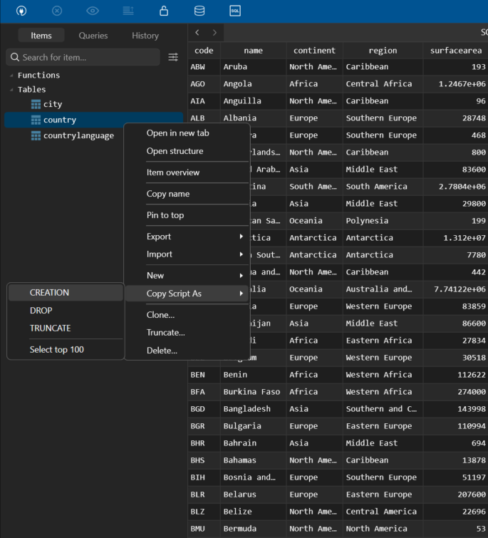

En el caso de la tabla country, la creacion seria 
```sql
-- Table Definition
-- Table Definition
CREATE TABLE "public"."country" (
    "code" bpchar(3) NOT NULL,
    "name" text NOT NULL,
    "continent" text NOT NULL,
    "region" text NOT NULL,
    "surfacearea" float4 NOT NULL,
    "indepyear" int2,
    "population" int4 NOT NULL,
    "lifeexpectancy" float4,
    "gnp" numeric(10,2),
    "gnpold" numeric(10,2),
    "localname" text NOT NULL,
    "governmentform" text NOT NULL,
    "headofstate" text,
    "capital" int4,
    "code2" bpchar(2) NOT NULL,
    PRIMARY KEY ("code")
);
```

## Indices - Index
Los indices son usados para mejorar el rendimiento de las consultas, al agregar un indice a una columna, se crea una tabla separada que contiene los valores de la columna y una referencia a la fila original. En resumen un indice es una estructura de datos que permite acceder rapidamente a los registros de una tabla basados en los valores de una o mas columnas, regularmete son arboles binarios. Un indice es basicamente un constrain tambien. Puede haber indices compuestos que afecten varias columnas.


## Creando indices
Creando un indice en la columna name:

```sql
CREATE UNIQUE INDEX "unique_country_name" ON country (
    name
);
```

Creando un indice de la columna continent:
```sql
CREATE INDEX "index_country_continent" ON country (
    continent
);
```

-- 1. Crear una llave primaria en city (id)

Antes de modificar la llave primary de city tenemos que eliminar, el registro con el id duplicado 4029:
```sql
SELECT * FROM city WHERE id = 4029;
```

```sql
DELETE FROM city WHERE id = 4029;
```
```sql
ALTER TABLE city
    ADD PRIMARY KEY (id);
```

-- 2. Crear un check en population, para que no soporte negativos
```sql
ALTER TABLE city
    ADD CHECK (population >= 0);
```

-- 3. Crear una llave primaria compuesta en "countrylanguage"
-- los campos a usar como llave compuesta son countrycode y language

Tenemos duplicado el contrycode y language TZA, Gogo
```sql
SELECT * FROM countryLanguage WHERE countrycode = 'TZA' AND language = 'Gogo';
```
Eliminar este elemento duplicado solo uno de ellos:
```sql
DELETE FROM countryLanguage
WHERE ctid IN (
  SELECT ctid FROM countryLanguage
  WHERE countrycode = 'TZA'
    AND language = 'Gogo'
  LIMIT 1
);
```

```sql
ALTER TABLE countryLanguage
    ADD PRIMARY KEY(countrycode, language);
```

-- 4. Crear check en percentage, 
-- Para que no permita negativos ni números superiores a 100
```sql
ALTER TABLE countryLanguage
    ADD CHECK (percentage >= 0 AND percentage <=100);
```

## UNIQUE INDEX
Se debe colocar indices en las columnas, donde son transaccionales o con alta consulta. El crear un indice es un proceso costoso en terminos de recursos, por lo que se debe hacer con precaución, y bloqueante porlo que mientras se crea no se puede realizar commits a la tabla.

```SQL
CREATE UNIQUE INDEX "unique_name_countrycode_district" ON city(
    name,
    countrycode,
    district
);
```

No se puede eliminar directamente vemos cuales estan duplicados
``` sql
SELECT * FROM city WHERE 
	name = 'Rafah' AND
    countrycode = 'PSE' AND
    district = 'Rafah';
```

Eliminamos un registro duplicado de todos los duplicados

```sql
DELETE FROM city
WHERE ctid IN (
  SELECT ctid FROM (
    SELECT ctid,
           row_number() OVER (
             PARTITION BY name, countrycode, district
             ORDER BY ctid
           ) AS rn
    FROM city
  ) t
  WHERE rn = 2
);
```

Crear otro indice que no es unico en distrito:
```SQL

CREATE INDEX "index_district" ON city(
    district
);
```

## Creando llaves foraneas 
De country a city, uno a muchos.
De country a countrylanguage, uno a muchos.

Para hacerlo lo debo hacer de country a city porque las llaves foraneas siempre apuntan a la llave primaria de la tabla referenciada. Ademas add constrains adecuados para asegurar integridad referencial.

```sql
ALTER TABLE city
    ADD CONSTRAINT fk_country_code
    FOREIGN KEY (countrycode)
    REFERENCES country(code); -- ON DELETE CASCADE
```
No se puede realizar porque no tenemos el countrycode pais de AFG en la tabla country.

```SQL
SELECT * FROM country WHERE countrycode = 'AFG';
```
Por lo que vamos a crear el countrycode AFG en la tabla country.

```SQL
INSERT INTO country
		values('AFG', 'Afghanistan', 'Asia', 'Southern Asia', 652860, 1919, 40000000, 62, 69000000, NULL, 'Afghanistan', 'Totalitarian', NULL, NULL, 'AF');
```

Despues de eso ya podemos crear el foreign key en city.

Crear la llave foranea para countrylanguage:
```sql
ALTER TABLE countryLanguage
    Iuntry(code); -- ON DELETE CASCADE
```

Lo que queremos haces con las llaves foraneas es;t--ener la integridadreferencial.

Esto daria error porque tenemos registros en city con countrycode AFG.
```SQL
DELETE FROM country WHERE code = 'AFG';
```

## ON DELETE CASCADE

```SQL
SELECT * FROM city WHERE countrycode = 'AFG';
```
```SQL 
SELECT * FROM country WHERE code = 'AFG';
```

Si tenemos un codigo o columna que cambia mucho no es un buen candidato para ser una llave primaria. Porque cuesta encontrar o referenciar estos datos debido a que cambian mucho.

Quiero que al borrar el pais en cascada se borre todos los registros en city que tengan ese countrycode.

```sql
ALTER TABLE city
    DROP CONSTRAINT IF EXISTS fk_country_code;

ALTER TABLE city
    ADD CONSTRAINT fk_country_code
    FOREIGN KEY (countrycode)
    REFERENCES country(code)
    ON DELETE CASCADE;
```
```sql
ALTER TABLE countryLanguage
    DROP CONSTRAINT IF EXISTS fk_country_code;

ALTER TABLE countryLanguage
    ADD CONSTRAINT fk_country_code
    FOREIGN KEY (countrycode)
    REFERENCES country(code)
    ON DELETE CASCADE;
```


Eliminamos el countrycode AFG de la tabla country.
```SQL
DELETE FROM country WHERE code = 'AFG';
```
